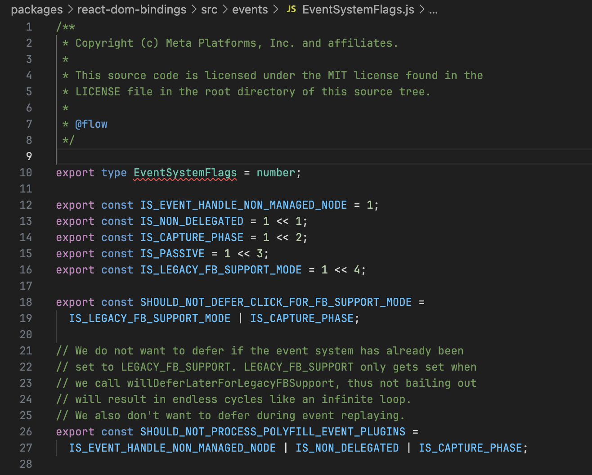

# Usage of Bitwise operations in ReactJS

Exploring how ReactJS uses bitwise masks as well as bitwize operations.

### TL;DR

React uses bitmasks extensively. Primary because it allows to check if some state includes in others fast and easyly.

## `react-reconciler` Tags

### ReactFiberFlags

First example is usage of bitmasks to define type of Nodes in React Fibler Tree. Here we see Node states are defined as bitmasks: `Incomplete`, `NeedsPropagation`, and others.

> `packages/react-reconciler/src/ReactFiberFlags.js`


Then it's used to check whether we need to rerender subtree or not by checking:

```js
const rootHasEffect =
    (finishedWork.flags &
        (BeforeMutationMask | MutationMask | LayoutMask | PassiveMask)) !==
    NoFlags;
```

> `packages/react-reconciler/src/ReactFiberWorkLoop.js`


Let's understand this code.

First, `OR` of `BeforeMutationMask | MutationMask | LayoutMask | PassiveMask` is found. The masks of corresponding values combine in one. Those are flags which we check current node flags on.

Then, bitwise `AND` is performed between `finishedWork.flags` and our combined flags. Since `AND` produce `1` only if same bit in both values is `1`, we'll find intersection of node flags with our newly computed bitmask.

As last part, we check if result of `AND` is not blank (`NoFlags` is zero or `0` or `0b0`). So if node flags have no common flags with our searched masks, our check evaluates to `0 !== 0` which returns `false`.

### React running mode

Along with Node tags, bitmasks are used to specify React running mode:
 

We can se that inetrnally React has 7 modes!
- NoMode
- ConcurrentMode
- ProfileMode
- DebugTracingMode
- StrictLegacyMode
- StrictEffectsMode
- NoStrictPassiveEffectsMode

To check if fiber node is in debug mode, they check `sourceFiber.mode & DebugTracingMode` which will result in non-zero value in case `sourceFiber.mode` contains `DebugTracingMode`'s bit.


What neat here, is how easy they combine fiber node modes together via bitwise `OR` operator:


### Event types

Moreover, React uses bitmasks to define event system flags:


Then they use the flags the same way as in previous cases:
- Adding mode to current event with `OR` operation
- Chekcing on specific mode with `AND` like this:
  

> Interestingly, in eventy types the modes are written via bit left shifts `1 << 2`, in in contrary to previous example, where masks were written explicitly `0b0000000100000000000000000000`

> Also, I found funny that `IS_PASSIVE` event type is not used in React monorepo at all!

### Worth to mention

React scheduler has priorities for each task to render. When I started looking at React codebase, I expected to see them first as bitmasks. But how I was surprised, when actually they are not:
> `packages/scheduler/src/SchedulerPriorities.js`


But after a little of thinking, it's obvious why priorities are not bitmasks. The operation with proprities we need to perform is comparison with other propritis: whether one's bigger than the other. But bitmasks help us when we need to easily include or exclude value from the set. So, while it would be possible to have proproties as bitmasks, simple numbers work sufficiently for this case.